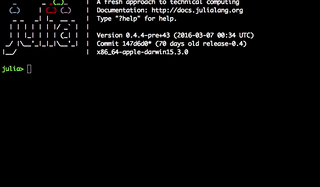
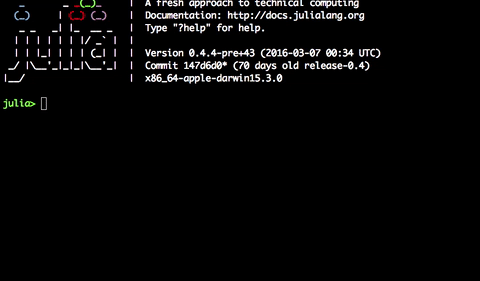
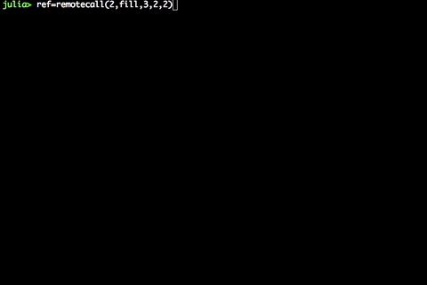
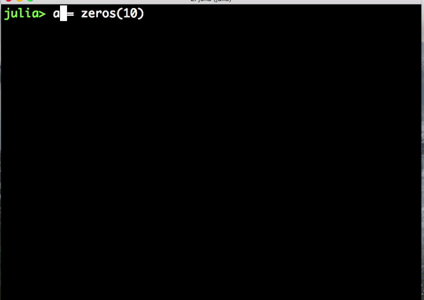

.. _Introduction:

============
Introduction
============

Julia language is a high-level, high-performance dynamic programming language for technical computing. Between several other features  it provides a sophisticated compiler and distributed parallel execution, that allows the user to code sophisticated applications. Given the novelty of the language, is hard to find documentation that help the beginners and new learners to understand the core concepts and advantages of using Julia. For this reason, and mostly as a new learner, I provide this work that show by example some usages and advantages of using `Julia <julialang.com/docs>`_ . 

The example I will be refering to is the Delta-stepping algorithm. Which is a clever proposition developed by  Madduri et. all. In their paper Parallel Shortest Path Algorihtm for Solving Large Scale Instances; along with the one by M. Kranjcevic $\Delta$-Stepping Algorithm for Shared Memories Architectures. 

This algorithm will be specially used  to find the contour of an image. Using the package `Images <https://github.com/timholy/Images.jl>`_ I converted the image to gray scale and calculate the gradient to compute a function cost. Later I  set a directed graph where the pixels where the nodes and the cost to go to a neighbor pixel with different color was high, then using the delta-stepping algorithm I can find the shortest path, which was also the contour. 

A parallel implementation in Julia of this algorithm is propposed. For this implementation I ran several test to evaluate it's performance. In particular three images were selected. 

There are many changes that still have to be done. In the next version, I will be updating the implementation changing the buckets from a dictionary of sets(not very efficient) to a shared list (to provide better parallelism). As well I will be working on the tutorials so that clear and nicer examples can be shown. 

Note: All the information  provided here is based on the Official Documentation of Julia, any other source will be cited explicitely.  

A Little Bit of Julia. 
***********************

Instalation might be very tricky. However for learning I suggest you to download the binary extension that can be found `Here <http://julialang.org/downloads/>`_ 

When you have it go to the folder `julia/bin` and simply execute `Julia`. Like:

.. code:: bash
    
    julia 

|first|

This initialization would start julia by default with one process. If you want to start with more processes you need to specify it with the following command (It makes sense when -p # correlates with the number of processors on your machine). For example on mine two cores.  

.. code:: bash
    
    julia -p 2 

|startp| 

In case you forget to start with this command, you can add more procs from the julia command line:

.. code :: bash 

  addprocs()

|addprocs|

Which will add all the available processors by default, but you can specify too just puting inside the parenthesis as many process as cores has your machine. 

You can get at any momment the number of available workers by running the following code: 

.. code:: bash
  
    nprocs()

|nprocs|

   

