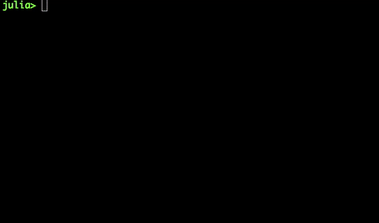

.. _setup:

Set Up the graph. 
=================

In the last section I explained how to extract information from a picture and more important how to transform that information in order to make it relevant for our purposes. 

In this section I will explain how I build the graph out of the image. 

The directed graph we are trying to set is described by a list of items where each item has the following items (V1,V2, C) where V1 is connected with V2 (in that direction) and C is the cost of going from V1 to V2. 

Pixels, vertex and edges
************************

The nodes of our graph would be given by each pixel of the image. In future releases we will reduce significatively the number of pixels to describe a picture. Right now for the rose example we will be dealing with around 200.000 nodes. Heavy enough to make our algorithm to go for around a minute before getting the answer. In the future the idea is reduce those nodes to the half using zooming or different staff. 

The edges are therefore a bigger problem. Each pixel has eight neigbours (I considered up,down, left, right and the corners), so there are 8 edges defined for each pixel. Setting the set of edges from our graph to around a million edges! This is just a huge ammount of information. In the following releases this will be  reduced significatively, because this causes a poor performance of the application. 

Cost function
**************

As explained before the reciprocus of the gradient would be used to calculate the cost. Actually the cost would be given by the gradient in the ending pixel itself. 

Setup function
**************

The following code is used to setup the graph. The input is an image and the output is a graph in the structure previously explained. 

.. code:: bash 

	using Images, Colors, FixedPointNumbers, ImageView
	function setup(A)
		x,y = size(A)
		list=Array{Float64}[]
		img=convert(Image{Gray{Ufixed8}}, A)
    xx,yy=imgradients(img)
    c=(sqrt(xx.^2+yy.^2))
    cost=1./(c.+1)
		for i in x+2:length(A)-(x+1)
       		edge=[i,i+1,cost[i+1]]
       		push!(list,edge)
       		edge=[i,i-1,cost[i-1]]
       		push!(list,edge)
       		edge=[i,i-x,cost[i-x-1]]
       		push!(list,edge)
       		edge=[i,i+x,cost[i+x]]
       		push!(list,edge)
       		edge=[i,i-x-1,cost[i-x-1]]
       		push!(list,edge)
       		edge=[i,i-x+1,cost[i-x+1]]
       		push!(list,edge)
       		edge=[i,i+x-1,cost[i+x-1]]
       		push!(list,edge)
       		edge=[i,i+x+1,cost[i+x+1]]
       		push!(list,edge)
		end
		return list
	end

Example
********

The following example ran over the rose picture would show the bast number of edges created by this approach. This would change in future releases. 

|setup|

