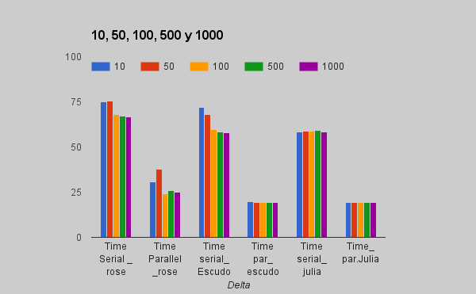

.. _profiling:

Profiling the Performance:
==========================

Julia has `@time`, `@elapsed` and  `@allocated` profiling tools. The firs one, time the application and shows the memory allocations  but shows the result as well. The second one would only output the time and the third one would only output the memory allocations. 

This code was implemented to time and measure the memory allocation of the algorithm. 

Code for serial
***************
.. code:: bash
	
	using Images, Colors, FixedPointNumbers, ImageView
	img=load("rose.png")
	include("setup.jl")
	include("deltastep.jl")
	include("relax.jl")
	include("path.jl")
	graph=setup(img)
	f=open("output.txt","w")
	for i in [10,50,100,500,1000]
	Time=@elapsed Deltastep(graph,5000,i)
	Alloc=@allocated Deltastep(graph,5000,i)
	write(f,"  Deltastep : $i Time Elapsed $Time Memory Allocations : $Alloc \n")
	end
	close(f)

Code for parallel
*****************

.. code:: bash
	
	using Images, Colors, FixedPointNumbers, ImageView
	addprocs()
	img=load("Imagenes/rose.png")
	include("setup.jl")
	include("relax.jl")
	include("path.jl")
	include("deltastepar.jl")
	graph=setup(img)
	f=open("outputpar.txt","w")
	for i in [10,50,100,500,1000]
	Time=@elapsed Deltastep(graph,5000,i)
	Alloc=@allocated Deltastep(graph,5000,i)
	write(f,"Image :$size  Deltastep : $i Time Elapsed $Time Memory Allocations : $Alloc \n ")
	end
	close(f)

Results
========

Running the profiling tools on the super computer Stampede I obtained the following results: 

|experiment|

The parallel performance increased significatively. Even getting to a speed up of 2.9 which was closer to a linear performance. 

|allocations|

The results of the memory were kind of high in parallel. This is due to the used of the memory when I am creating the arrays in every node, and then merging the branches into the principal one.

Since julia is still on development (but now is reaching 0.5 dev version) is not available yet on Stampede. I use the binaries available to run it on stampede. But I could not run it with more than 3 process. Everytime I try to run it with more cores I got "Could not allocate pools". 

Analysis
=========

The performance observed on three processors of Stampede was about three times higher than in the serial code. This let us make conclusions on the weak scalling property of the code. However, due to the large size of the images, is important to notice that the performance was impacted great. In future releases this problem would be addressed. Specially using image compressing tools. that would let me describe the image very accurate with less pixels. 

On the other hand, the problems I experienced running the code on Stampede shows that Julia is still on development and there are some compability problems in large scale computers. As well is necessary to increase the documentation coverage, specially for large scientific applications that requires more introduction for beginners. 

However from the implementation is clear that Julia is a very dynamic language for programming. I have worked before in python, and it is easy to understand the new semantics given the proximity to that technical language in particular. In Images for instance, there is a comfortable and good proximity to matlab syntax. 

Demo
=====

As a demo I ran the code, using the node img[11637] as the beginning node and the node img[154455]. Then following the guide provided in the *quick reference* section I obtained the following image. I choose the view function of the gradient cost function so it is more visible the path found: 

|rose1|

.. |rose1| image :: ../../Imagenes/rose1.png

.. |allocations| image:: ../../Imagenes/allocations.png
